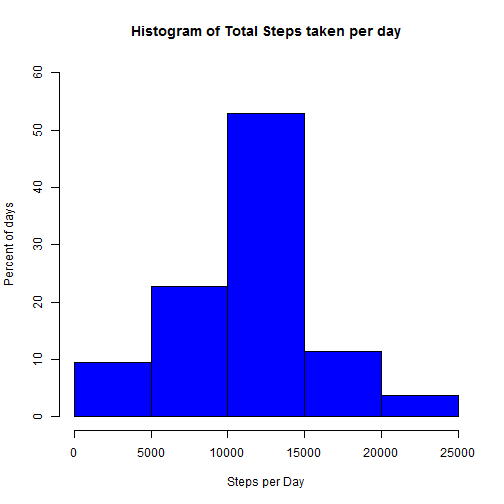
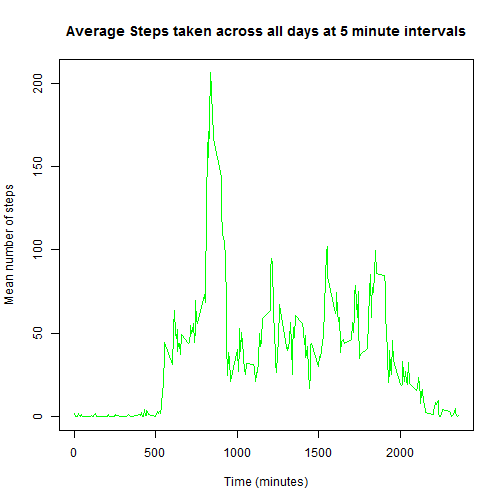
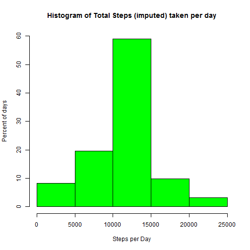
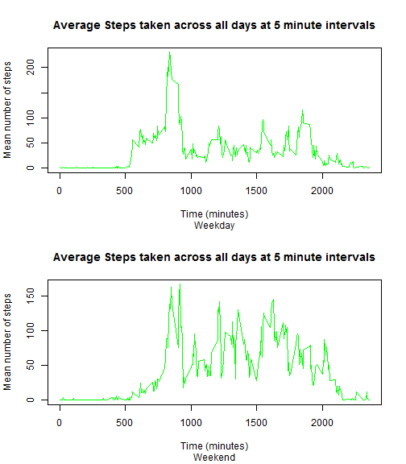

```r
options(scipen = 1000, digits = 6)
```


####Loading and preprocessing the data


```r
data<-read.csv("activity.csv",head=TRUE)
data$date <- as.Date(data$date,"%Y-%m-%d")
head(data)
```

```
##   steps       date interval
## 1    NA 2012-10-01        0
## 2    NA 2012-10-01        5
## 3    NA 2012-10-01       10
## 4    NA 2012-10-01       15
## 5    NA 2012-10-01       20
## 6    NA 2012-10-01       25
```

####What is mean total number of steps taken per day?

1. Make a histogram of the total number of steps taken each day
2. Calculate and report the mean and median total number of steps taken per day


```r
totalStepsDay <- tapply(data$steps, data$date,sum)
```

```r
h = hist(totalStepsDay)
```

```r
h$density = h$counts/sum(h$counts)*100
plot(h,freq=F, col="blue",xlab="Steps per Day", 
     ylab="Percent of days", main="Histogram of Total Steps taken per day", ylim=c(0,60))
```

 

```r
meanValue<-round(mean(totalStepsDay,na.rm=TRUE),2)

medianValue<-median(totalStepsDay,na.rm=TRUE)
```

The mean an median total number of steps taken per day where 10766.19 and  10765

####What is the average daily activity pattern?
1.     Make a time series plot (i.e. type = "l") of the 5-minute interval (x-axis) and the average number of steps taken, averaged across all days (y-axis)
2. Which 5-minute interval, on average across all the days in the dataset, contains the maximum number of steps?


```r
meanStepsInterval <- tapply(data$steps, data$interval, mean,na.rm=TRUE)

plot(row.names(meanStepsInterval),meanStepsInterval,type="l", col="green",
     main="Average Steps taken across all days at 5 minute intervals",
     xlab="Time (minutes)", 
     ylab="Mean number of steps"
     )
```

 

```r
maxStepsMeanInterval<-round(max(meanStepsInterval),2)
intervalMax <- which.max(meanStepsInterval)
intervalMaxSteps <- names(intervalMax)
```

The 5-minutes interval with the maximum average number of steps an median total number of steps taken across all the days is 835 with   206.17 steps

####Imputing missing values
Note that there are a number of days/intervals where there are missing values (coded as NA). The presence of missing days may introduce bias into some calculations or summaries of the data.

1. Calculate and report the total number of missing values in the dataset (i.e. the total number of rows with NAs)


```r
numberMissing<-sum(is.na(data))
```
The total number of missing values in the dataset is `numberMissing`

2. Devise a strategy for filling in all of the missing values in the dataset. The strategy does not need to be sophisticated. For example, you could use the mean/median for that day, or the mean for that 5-minute interval, etc.


```r
# The imputation was made filling the missing value with the observed mean from the corresponding interval

library(plyr)
listTemp<-split(data, data$interval)

for (i in 1:288) {
        listTemp[[i]]$steps[is.na(listTemp[[i]]$steps)] <- mean(listTemp[[i]]$steps, na.rm=TRUE)
}
```

3. Create a new dataset that is equal to the original dataset but with the missing data filled in.


```r
#Unsplit the data
data2<-unsplit(listTemp, data$interval)
```


4. Make a histogram of the total number of steps taken each day and Calculate and report the mean and median total number of steps taken per day. Do these values differ from the estimates from the first part of the assignment? What is the impact of imputing missing data on the estimates of the total daily number of steps?


```r
totalStepsDay <- tapply(data2$steps, data2$date,sum)
```

```r
h = hist(totalStepsDay)
```

```r
h$density = h$counts/sum(h$counts)*100
plot(h,freq=F, col="green",xlab="Steps per Day", 
     ylab="Percent of days", main="Histogram of Total Steps (imputed) taken per day", ylim=c(0,60))
```

 

```r
meanValue<-round(mean(totalStepsDay),2)

medianValue<-round(median(totalStepsDay,na.rm=TRUE),2)
```
After the imputation step the mean an median total number of steps taken per day where 10766.19 and  10766.19. *The impact of imputting missing values was observed over median*


#### Are there differences in activity patterns between weekdays and weekends?
For this part the weekdays() function may be of some help here. Use the dataset with the filled-in missing values for this part.

1. Create a new factor variable in the dataset with two levels - "weekday" and "weekend" indicating whether a given date is a weekday or weekend day.


```r
data2$dayType <- ifelse(weekdays(data2$date) == "sábado" | weekdays(data2$date) == "domingo", 
                        "Weekend", "Weekday")
```


2. Make a panel plot containing a time series plot (i.e. type = "l") of the 5-minute interval (x-axis) and the average number of steps taken, averaged across all weekday days or weekend days (y-axis). See the README file in the GitHub repository to see an example of what this plot should look like using simulated data.

```r
listTemp<-split(data2, data2$dayType)


par(mfrow = c(2, 1))

for (i in 1:2){
        meanStepsInterval <- tapply(listTemp[[i]]$steps, listTemp[[i]]$interval, mean)
        
        plot(row.names(meanStepsInterval),meanStepsInterval,type="l", col="green",
             main="Average Steps taken across all days at 5 minute intervals",
             xlab="Time (minutes)", 
             ylab="Mean number of steps",
             sub=names(listTemp)[i])
}
```

 

